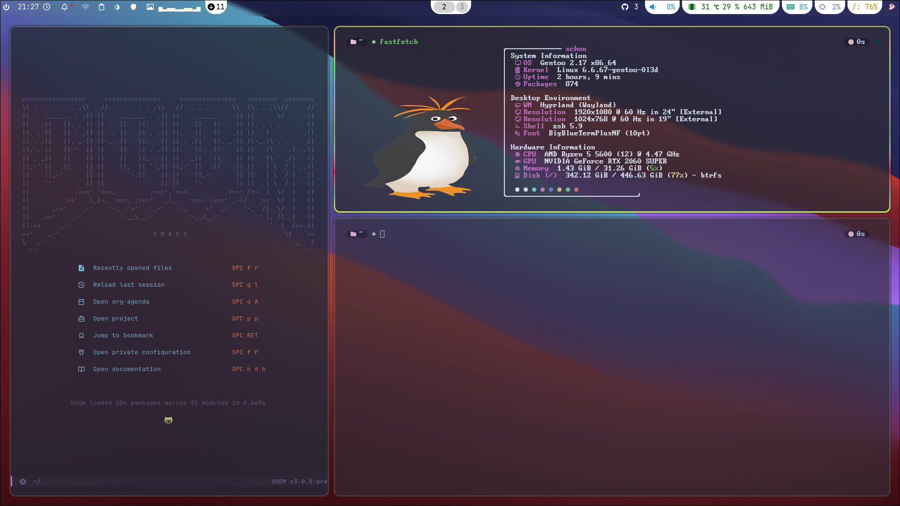
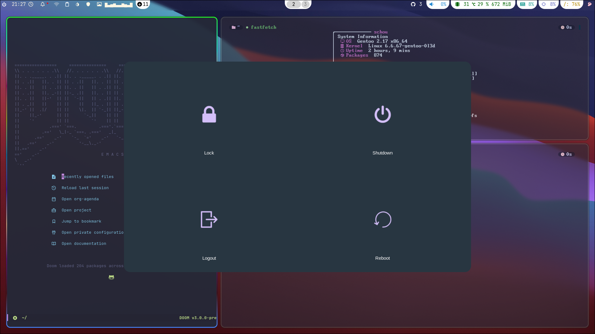
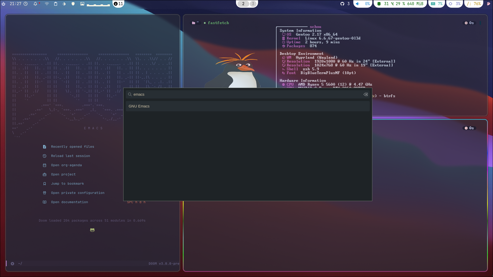
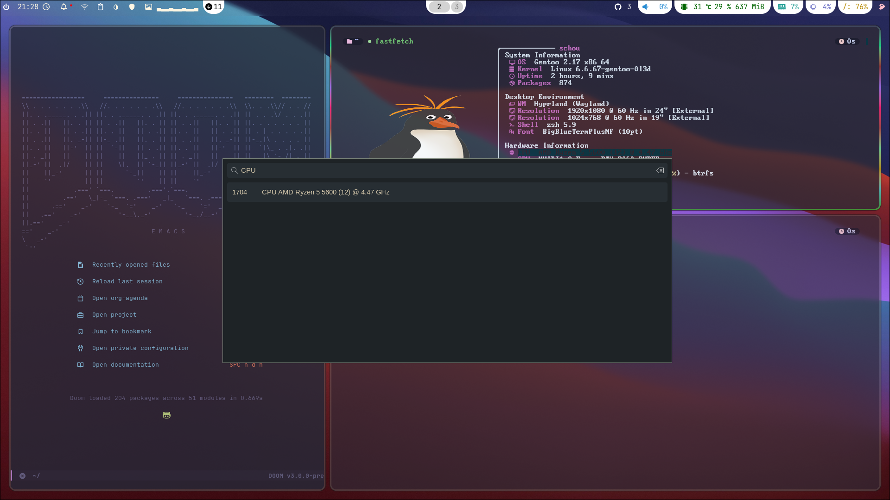

# Table of Contents

1.  [Dotfiles](#org62433a6)
    1.  [System](#org5a22863)
    2.  [Dotfiles](#org08960dc)
    3.  [Packages](#org98c5976)
    4.  [Installation Script](#org133e675)
    5.  [Images](#orga5960da)

# Dotfiles

Gentoo Linux dotfiles.

## System

<table border="2" cellspacing="0" cellpadding="6" rules="groups" frame="hsides">

<colgroup>
<col  class="org-left" />

<col  class="org-left" />
</colgroup>
<tbody>
<tr>
<td class="org-left">CPU</td>
<td class="org-left">AMD R5 5600</td>
</tr>

<tr>
<td class="org-left">GPU</td>
<td class="org-left">RTX 3060TI</td>
</tr>

<tr>
<td class="org-left">RAM</td>
<td class="org-left">32 GIGACHAD</td>
</tr>
</tbody>
</table>

## Dotfiles

<table border="2" cellspacing="0" cellpadding="6" rules="groups" frame="hsides">

<colgroup>
<col  class="org-left" />

<col  class="org-left" />
</colgroup>
<tbody>
<tr>
<td class="org-left"><b>DE/WM</b></td>
<td class="org-left">Hyprland</td>
</tr>

<tr>
<td class="org-left"><b>BAR</b></td>
<td class="org-left">Waybar</td>
</tr>

<tr>
<td class="org-left"><b>LAUNCHER</b></td>
<td class="org-left">Wofi</td>
</tr>

<tr>
<td class="org-left"><b>SHELL</b></td>
<td class="org-left">Zsh</td>
</tr>

<tr>
<td class="org-left"><b>LOGOUT MENU</b></td>
<td class="org-left">wlogout</td>
</tr>

<tr>
<td class="org-left"><b>TERMINAL</b></td>
<td class="org-left">kitty</td>
</tr>

<tr>
<td class="org-left"><b>FETCH</b></td>
<td class="org-left">fastfetch</td>
</tr>

<tr>
<td class="org-left"><b>EDITOR</b></td>
<td class="org-left">DoomEmacs</td>
</tr>

<tr>
<td class="org-left"><b>SYSMONITOR</b></td>
<td class="org-left">Btop</td>
</tr>

<tr>
<td class="org-left"><b>GTK</b></td>
<td class="org-left">Fluent</td>
</tr>

<tr>
<td class="org-left"><b>QT/Kvantum</b></td>
<td class="org-left">Fluent</td>
</tr>

<tr>
<td class="org-left"><b>Cursor</b></td>
<td class="org-left">Material</td>
</tr>

<tr>
<td class="org-left"><b>INIT</b></td>
<td class="org-left">OpenRC</td>
</tr>
</tbody>
</table>

## Packages

<table border="2" cellspacing="0" cellpadding="6" rules="groups" frame="hsides">

<colgroup>
<col  class="org-left" />
</colgroup>
<tbody>
<tr>
<td class="org-left">doas</td>
</tr>

<tr>
<td class="org-left">eclean-kernel (gentoo)</td>
</tr>

<tr>
<td class="org-left">sysklogd (gentoo)</td>
</tr>

<tr>
<td class="org-left">lz4</td>
</tr>

<tr>
<td class="org-left">unrar</td>
</tr>

<tr>
<td class="org-left">emacs</td>
</tr>

<tr>
<td class="org-left">nano</td>
</tr>

<tr>
<td class="org-left">all-the-icons + (-dired)</td>
</tr>

<tr>
<td class="org-left">emacs-ebuild-plugins</td>
</tr>

<tr>
<td class="org-left">nerd-icons</td>
</tr>

<tr>
<td class="org-left">eselect-repository (gentoo)</td>
</tr>

<tr>
<td class="org-left">cliphist</td>
</tr>

<tr>
<td class="org-left">fastfetch</td>
</tr>

<tr>
<td class="org-left">nwg-look</td>
</tr>

<tr>
<td class="org-left">genlop + gentoolkit + portage-utils (gentoo)</td>
</tr>

<tr>
<td class="org-left">zsh</td>
</tr>

<tr>
<td class="org-left">just (dev-build gentoo)</td>
</tr>

<tr>
<td class="org-left">rust-bin</td>
</tr>

<tr>
<td class="org-left">prismlauncher</td>
</tr>

<tr>
<td class="org-left">gamemode</td>
</tr>

<tr>
<td class="org-left">steam-launcher</td>
</tr>

<tr>
<td class="org-left">nm-applet</td>
</tr>

<tr>
<td class="org-left">hyprlock</td>
</tr>

<tr>
<td class="org-left">hyprshot</td>
</tr>

<tr>
<td class="org-left">swaync</td>
</tr>

<tr>
<td class="org-left">swww</td>
</tr>

<tr>
<td class="org-left">waybar</td>
</tr>

<tr>
<td class="org-left">wl-clipboard</td>
</tr>

<tr>
<td class="org-left">wlogout</td>
</tr>

<tr>
<td class="org-left">wofi</td>
</tr>

<tr>
<td class="org-left">hyprland</td>
</tr>

<tr>
<td class="org-left">fontawesome</td>
</tr>

<tr>
<td class="org-left">jetbrains-mono</td>
</tr>

<tr>
<td class="org-left">nerdfonts</td>
</tr>

<tr>
<td class="org-left">noto-emoji</td>
</tr>

<tr>
<td class="org-left">cava</td>
</tr>

<tr>
<td class="org-left">pavucontrol</td>
</tr>

<tr>
<td class="org-left">playerctl</td>
</tr>

<tr>
<td class="org-left">pulseaudio</td>
</tr>

<tr>
<td class="org-left">dnscrypt-proxy</td>
</tr>

<tr>
<td class="org-left">discord (vesktop-bin)</td>
</tr>

<tr>
<td class="org-left">networkmanager</td>
</tr>

<tr>
<td class="org-left">zapret</td>
</tr>

<tr>
<td class="org-left">fragments (torrent client)</td>
</tr>

<tr>
<td class="org-left">flatpak</td>
</tr>

<tr>
<td class="org-left">inxi</td>
</tr>

<tr>
<td class="org-left">btop</td>
</tr>

<tr>
<td class="org-left">zen-browser</td>
</tr>

<tr>
<td class="org-left">kitty</td>
</tr>

<tr>
<td class="org-left">xterm</td>
</tr>

<tr>
<td class="org-left">kvantum</td>
</tr>

<tr>
<td class="org-left">nwg-look</td>
</tr>

<tr>
<td class="org-left">exercism</td>
</tr>
</tbody>
</table>

## Installation Script

coming soon&#x2026;

## Images

**Normal**

**Wlogout**

**Wofi**

**Clipboard**

